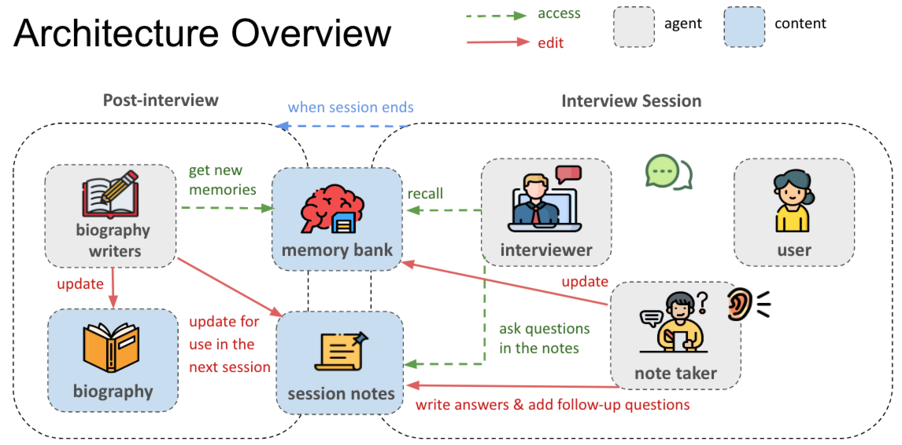
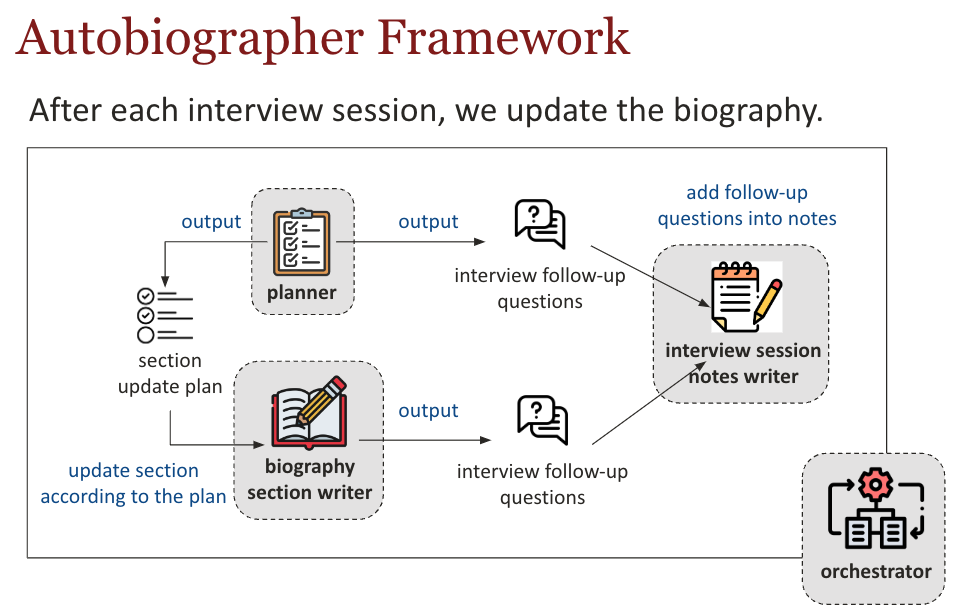

# AI Autobiographer

**AI Autobiographer** is a framework that uses AI agents to conduct interviews and write biographies for users 📝

**Key Features**:

- 🤝 Natural conversation flow
- 🧠 Intelligent memory management
- 📚 Structured biography creation
- 🔄 Continuous learning from interactions
- 🔌 Optional backend service mode

## Framework Overview

The framework is illustrated in the following image where:

- 🤖 Gray boxes: AI Agents
- 📘 Blue boxes: Memory & Content Storage



The project is structured as follows:

```bash
# 1. Core Interview Components
src/
├── interview_session/  # Manages live interview interactions
├── agents/            # AI team members (Interviewer, Writer, etc.)
├── user/              # User interaction handling

# 2. Memory & Content
├── biography/         # Biography creation & management
├── memory_bank/      # Long-term memory storage
├── session_note/     # Interview notes & summaries

# 3. Core Utils
├── llm/              # AI model interactions
└── utils/            # Helper functions

# 4. Backend Modules
├── api/              # HTTP endpoints (when running as HTTP service)
└── database/         # Database integration (for backend mode)

# 5. Supporting Resources
data/                 # Test profiles & sample data
docs/                 # Documentation
logs/                 # Interview session logs
tests/                # Unit tests for [Memory & Content]
```

### 1. Core Interview Components

These modules handle the main interview interaction:

- `interview_session`: Core engine that manages the interview flow and conversation dynamics
- `agents`: Collection of specialized AI agents (Note taker, Biography writer, etc.)
- `user`: Handles user interactions and maintains user state during sessions

### 2. Memory & Content

Responsible for storing and organizing memories and content:

- `biography`: Manages the creation and organization of the final autobiography
- `memory_bank`: Storage system for user memories and experiences
- `session_note`: Maintains detailed records of each interview session

### 3. Core Utils

Essential utilities that support the main functionality:

- `llm`: Tools for interacting with language models
- `utils`: Common helper functions and shared utilities

### 4. Backend Modules

Optional components for running as a service:

- `api`: REST endpoints for HTTP service mode
- `database`: Database integration for persistent storage in backend mode

### 5. Supporting Resources

- `data`: Contains sample profiles for testing and development
- `docs`: Project documentation and design specifications
- `logs`: Interview session logs organized by user
- `tests`: Comprehensive test suite for all components

## Deeper Dive into Components

### Interview Workflow

The interview session is the core engine that drives conversations between AI agents and users. Here's how it works:

#### Core Models

Defined in `/session_models.py`:

- `Message`: Container for session messages
- `Participant`: Base class for session participants

#### Session Participants

Each participant in the session (user, interviewer, note taker, biography writers) implements an `on_message` method to handle incoming messages:

```python
class Participant:
    async def on_message(self, message: Message) -> None:
        # Handle new messages
        pass
```

#### Message Flow

1. **Main Conversation**:
   - Direct dialogue between interviewer and user
2. **Background Processing**:
   - Note taker updates memory bank and session notes
   - Note taker suggests follow-up questions
3. **Post-Interview**:
   - Biography team writes/updates biography
   - Session notes prepared for next interview

#### Publisher-Subscriber Pattern

- Uses async pub-sub for message distribution
- Each participant processes messages in their own thread
- Prevents blocking of the main conversation loop
- Implementation: `self.subscriptions` in `InterviewSession` class

#### Session Lifecycle

The interview continues until:

- User sends a goodbye message
- `Ctrl+C` is pressed
- `session_in_progress` flag becomes `False`

### AI Agents

#### User Agent

The user agent is used to simulate the real user's responses. We use this agent to test the system which eliminates the need to interact with the real user.

The user agents act according to the user profiles in the `USER_AGENT_PROFILES_DIR` directory which is specified in the `.env` file.

#### Interviewer

The interviewer directly interacts with the user. It asks user questions to explore the user's life. These information will be used to write the biography.

Tools:

- `recall`: Recall memories from memory bank to get the context of what user has said
- `respond_to_user`: Respond to user messages
- `end_conversation`: End the interview session

#### Note Taker

The note taker process user information and updated it into the memory bank and session notes.

Responsible for:

- Updating the session notes
- Updating the memory bank
- Proposing follow up questions

Tools:

- `update_memory_bank`: Update the memory bank with the new information
- `update_session_note`: Update the session notes with the new information
- `recall`: Recall memories from memory bank to help decide whether to ask a follow-up question and what to ask
- `decide_followups`: Decide whether to ask follow up questions to the user and what to ask
- `add_interview_question`: Add a follow-up interview question to the session notes

#### Biography Writing Team

The biography writing team operates under the `BiographyOrchestrator` to collaboratively create and refine the user's biography. Here's how the team works together:

- **Planner**: Develops writing plans and proposes follow-up questions to the user for additional input.
- **Section Writer**: Writes the biography for a specific section based on the planner's guidance and suggests follow-up questions to gather further details.
- **Session Summary Writer**: Prepares session notes for upcoming interviews, incorporating collected memories and follow-up questions from both the planner and writer agents.



##### 1. Planner

The planner read the existing biography and new information collected from the interview and make plans to write the biography for multiple sections

Input:

- Existing biography
- New memories to incorporate

Output:

- Plans to write the biography for multiple sections
- Follow up questions used to collect more information from the user

##### 2. Section Writer

The writer executes the plan - writing the biography for a given section

Input:

- Existing content of the section
- The plan to write the biography for a given section

Output:

- Biography for a given section
- Follow up questions used to collect more information from the user

Tools:

- `get_section`: Get the existing content of specified section (TODO: not used yet)
- `update_section`: Update the section with the new content
- `add_section`: Create a new section with initial content
- `add_follow_up_question`: Add a follow-up question to the section

##### 3. Session Summary Writer

The session summary writer prepare the session notes for the next interview session

Input:

- Existing session notes
- Follow-up questions from the planner and section writer agents
- New memories collected during the session

Output – updated session notes content

- Summary of the last interview
- User portrait
- Interview questions

Tools:

- `update_last_meeting_summary`: Update the summary of the last interview
- `update_user_portrait`: Update the user portrait
- `recall`: Recall memories from memory bank to help decide whether to add or delete an interview question
- `add_interview_question`: Add a follow-up interview question to the session notes
- `delete_interview_question`: Delete a follow-up interview question from the session notes

### Memory & Content

### Memory Bank

- Vector database storing user memories and information
- Supports semantic search for relevant memories
- Maintains metadata, importance scores, and timestamps
- Alternative implementation using NetworkX for graph-based storage (TODO: LightRAG?)
- Stores relationships between entities (people, places, events)

### Biography

- Hierarchical document structure
- Organized into sections and subsections
- Maintains version history and edit timestamps
- Supports different biography styles (chronological, thematic)

### Session Note

- Maintains structure for interview sessions
- Stores user information and session summaries
- Organizes questions by topics with hierarchical IDs
- Tracks notes and responses for each question
- Supports additional unstructured notes

### Backend Modules

You can find the design of the backend modules in the [Notion Doc](https://www.notion.so/Application-Design-160f97d87ef18075ae90efad6b14ca89#160f97d87ef180adb70ef351d2d0a0e9).

#### REST APIs

The backend modules are used to run the system as a service, usually in a cloud environment on port 8000.

The backend is structured as follows:

```bash
├── app.py
├── core
├── routers
└── schemas
```

- `app.py`: The main entry point for the backend
- `core`: The core functions (authentication and session management, etc.)
- `routers`: The routers for the backend
- `schemas`: The HTTP request and response schemas for the backend

#### Database

The database is used to store the user's information.

## Supporting Resources

### Unit Tests

The `tests` directory contains unit tests, particularly for the `Memory & Content` components. These components are crucial to the system and can be easily tested without involving LLM calls. It is recommended to run these tests before committing any changes.

- `biography`: Tests for the `Biography` class
- `session_note`: Tests for the `SessionNote` class

Running the tests:

```bash
pytest tests/biography/test_biography.py
pytest tests/session_note/test_session_note.py
```
