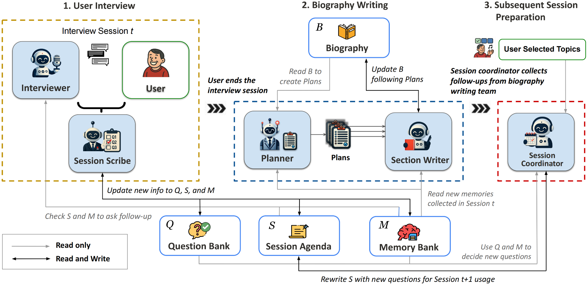

# StorySage

> **StorySage: Conversational Autobiography Writing Powered by a Multi-Agent Framework**  
> Shayan Talaei, Meijin Li, Kanu Grover, James Kent Hippler, Diyi Yang, Amin Saberi  
> arXiv:2506.14159 [cs.HC], 2025  
> [Paper](https://arxiv.org/abs/2506.14159)

## Overview

StorySage is a multi-agent AI system for 
conducting biographical interviews and generating 
autobiographies. The system uses specialized AI 
agents to conduct natural conversations, manage 
memory, and generate structured biographical 
content.

## Key Features

Our framework offers:

- 🤖 Multi-agent architecture for distributed task handling
- 🧠 Memory bank for long-term conversation context
- ❓ Dynamic question generation and topic management
- ✍️ Concurrent biography writing and updates
- 🎮 User-driven conversation control and editing interface

## System Architecture

StorySage operates through three main stages, each powered by specialized agents as shown in Figure 1:


*Figure 1: Overview of StorySage's multi-agent architecture*

1.**User Interview**

- **Interviewer Agent**: Conducts natural conversations and manages user interaction
- **Session Scribe Agent**: Processes conversation data, manages memory storage, and generates follow-up questions

2.**Biography Writing**

- **Planner Agent**: Analyzes biography structure and creates content update plans
- **Section Writer Agent**: Generates narrative content based on planner guidelines

3.**Session Planning**

- **Session Coordinator Agent**: Prepares agendas for future sessions and maintains conversation continuity

## Setup

**Requirements:**

- Python 3.12+
- Environment variables (see `.env.example`)

**Installation:**

```bash
pip install -r requirements.txt
```

## Usage

### Terminal Interaction

Run the interviewer:

```bash
python src/main.py --mode terminal --user_id <USER_ID>
```

**Required Parameters:**

- `--mode`: Specify the running mode. `terminal` indicates interactive terminal for direct conversation
- `--user_id`: Used to maintain context between sessions - you can use any name (e.g., "nick") to restore your previous conversation history in future sessions

**Optional Parameters:**

- `--user_agent`: Enable user agent mode
- `--voice_output`: Enable voice output
- `--voice_input`: Enable voice input
- `--restart`: Clear previous session data

**Notes:**

- Use the same `--user_id` to continue previous conversations
- Biographies are saved in `data/<user_id>/biography_*.json`
- Press Ctrl+C and Enter once to end a session

### Web UI Interaction

To use the web interface, you'll need to set up both the backend server and frontend:

#### 0. Switch to Backend Branch

First, switch to the backend branch which contains all the necessary server code:

```bash
git checkout backend
```

#### 1. Database Setup

Run the database setup script to create the database and tables:

```bash
# Create database and tables (preserves existing data)
python src/main.py --mode setup_db

# Reset database (WARNING: deletes all existing data)
python src/main.py --mode setup_db --reset
```

Note: This will create the database and tables, but **terminal mode doesn't use the database**.

#### 2. Start Backend Server

Run the interviewer in server mode with:

```bash
python src/main.py --mode server --port 8000
```

#### 3. Setup Frontend

For frontend setup and usage instructions, please check the documentation in the [StorySage Frontend](https://github.com/Hello-Imagine/StorySage_Frontend) repository.

## Citation

If you find this work helpful, please cite our paper:

```bash
# Basic run with just user ID
python src/main.py --user_id nick

# Run with voice features enabled
python src/main.py --user_id nick --voice_input --voice_output

# Restart a session with user agent
python src/main.py --user_id nick --restart --user_agent
```